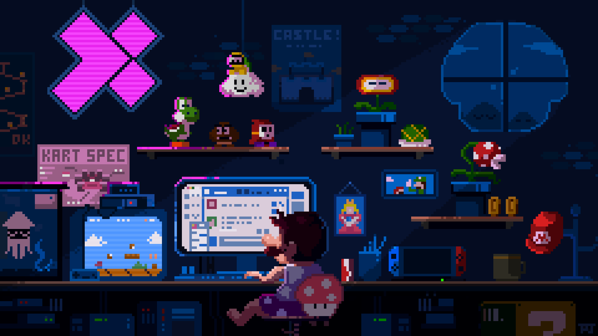

    

# 

 

 

<h2 align="center" >❖ About me ❖ </h2>  

<!--  apos formatar no ps com margins transparentes colocar aqui.  -->

Sou Bacharel em Sistemas de Informação pela Uninove, com foco em Desenvolvimento Web Full Stack (C# | .NET | React).

No Front-End, utilizo minha experiência com HTML, CSS, Bootstrap e Tailwind para construir interfaces funcionais e fiéis aos requisitos visuais. Atualmente, estou consolidando meus conhecimentos iniciais em React, aplicando-os no desenvolvimento de componentes responsivos e bem estruturados que facilitem a interação do usuário final (Designer UX/UI).

No Back-End, venho me especializando no ecossistema Microsoft, desenvolvendo com ASP.NET Core (MVC) e APIs RESTful. Aplico conceitos de Programação Orientada a Objetos (POO), arquitetura em camadas e Clean Architecture, além de integração com SQL Server utilizando Entity Framework Core. Possuo conhecimentos iniciais em Cloud Computing com Azure, incluindo Azure SQL, Azure Storage, App Services e Azure Functions (Serverless).

Utilizo IA Generativa como apoio no desenvolvimento, auxiliando na otimização de código, revisão de lógica e aceleração do aprendizado técnico. Além disso, utilizo ferramentas como Figma, Miro e Trello para garantir organização e visão estratégica, com Git e GitHub para versionamento.

 
Estou em constante evolução, buscando contribuir com projetos que integrem tecnologia, cloud e design de forma estratégica e eficiente.

  

-  Meu objetivo é de me tornar Full Stack e construir soluções completas do back ao front. 
-  Minhas tecnologias principais são HTML5, CSS3, JavaScript, React, C# e ASP.NET Core 
-  Tenho paixão por aprender e aplicar esses conhecimentos na criação de soluções inovadoras que unam tecnologia e design de forma estratégica. 

 

<h2 align="center" >❖ Connect with me! ❖</h2>
 

&nbsp;&nbsp;
&nbsp;&nbsp;

 

<h2 align="center" >❖ My Skills ❖ </h2>
 

            
        

   
  <h2>❖ GitHub Stats ❖</h2>
   
  

  

🔧 Stats gerados com [github-readme-stats](https://github.com/anuraghazra/github-readme-stats) por [Anurag Hazra](https://github.com/anuraghazra)

#
 

<picture >
  <source media="(prefers-color-scheme: dark)" srcset="https://raw.githubusercontent.com/Dev-Phap/dev-phap/gh-pages/github-contribution-grid-snake-dark.svg">
  <source media="(prefers-color-scheme: light)" srcset="https://raw.githubusercontent.com/Dev-Phap/dev-phap/gh-pages/github-contribution-grid-snake.svg">
  
</picture>

