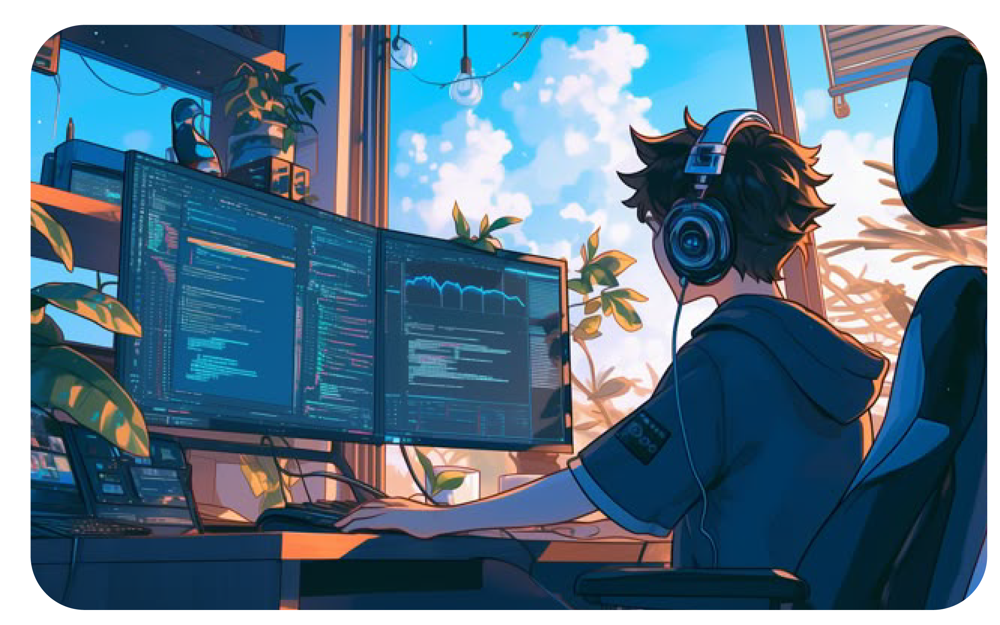

# 

# 

    

 <h2><strong>About me</strong></h2>

 Desenvolvedor Front-End Júnior em ascensão, com habilidades em HTML, CSS, JavaScript, TypeScript e Angular, aliadas a conhecimentos em design gráfico. Integro estética e funcionalidade no desenvolvimento de interfaces, criando experiências visuais atraentes e intuitivas.
 
Com uma abordagem multidisciplinar, busco soluções criativas e eficientes para a construção de sites e aplicações interativas. Estou em constante evolução, atualizando meus conhecimentos e abraçando novos desafios na área de tecnologia.

  

-  Meu objetivo atual é me tornar um Desenvolvedor Full Stack 
-  Minhas tecnologias principais são HTML5, CSS3, JavaScript com Angular. 
-  Tenho paixão por aprender e aplicar esses conhecimentos na criação de soluções inovadoras que unam tecnologia e design de forma estratégica. 

#

<h2 align="left">Connect with me!</h2>

<h2 align="left">My Stack ~</h2>

  

            
          
#

  <h3>* GitHub Stats *</h3>
   
  

  

#

<picture>
  <source media="(prefers-color-scheme: dark)" srcset="https://raw.githubusercontent.com/Dev-Phap/dev-phap/output/github-contribution-grid-snake-dark.svg">
  <source media="(prefers-color-scheme: light)" srcset="https://raw.githubusercontent.com/Dev-Phap/dev-phap/output/github-contribution-grid-snake.svg">
  
</picture>
